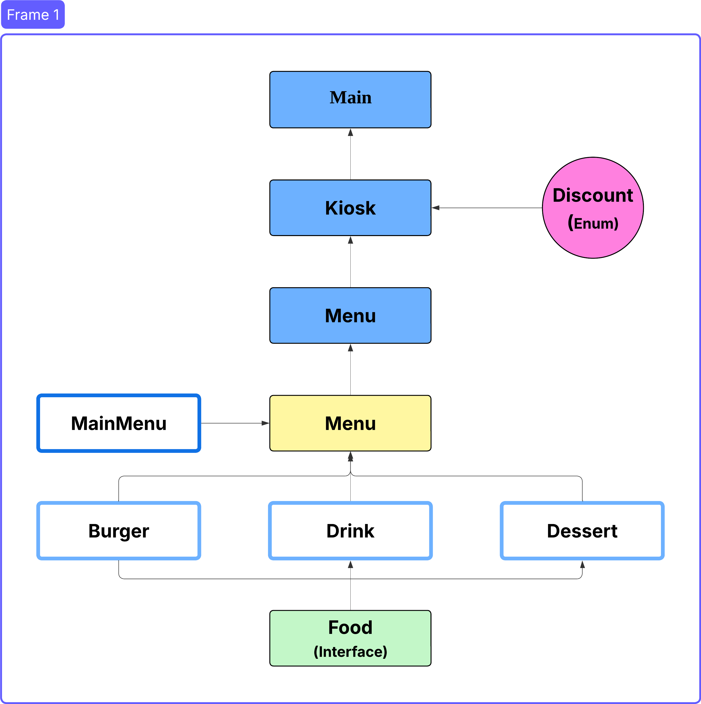

# 키오스크 만들기

**햄버거가게의 키오스크를 만들어라**

🐥 개발 기간 : 2025.04.24 ~ 2025.05.01

<br>
<br>

## ⚙️ 시작 가이드

### Config

아래 코드를 이용하여 레포지토리 클론 후 Config 적용

```
$ git clone https://github.com/GuDaeWoong/Kiosk.git
```

<br>
<br>

### 📁 Java Class Structure



<br>
<br>

### 요구사항 숙지

-   예를 들어, 기본적인 메뉴 선택 “입력”, “출력”, “각 메뉴 관리”, “전체 메뉴 관리” 등
-   사용자 인터페이스 방식 결정 : 콘솔 기반
-   예외 처리 : 입력값으로 허용한 값 이외의 값이 입력되었을 때와 같은 오류 처리

## Lv1 : 햄버거 메뉴 출력 및 선택하기

-   Scanner를 사용하여 여러 햄버거 메뉴를 출력.
-   제시된 메뉴 중 입력받은 숫자에 따라 다른 로직을 실행하는 코드를 작성.
-   반복문을 이용해서 특정 번호가 입력되면 프로그램을 종료.

## Lv2 : 객체 지향 설계를 적용해 햄버거 메뉴를 클래스로 관리하기

-   햄버거 메뉴를 MenuItem 클래스와 List를 통해 관리
-   MenuItem 클래스 생성
    -   설명 : 개별 음식 항목을 관리하는 클래스입니다. 현재는 햄버거만 관리.
    -   클래스는 이름, 가격, 설명 필드를 갖게한다.
-   main 함수에서 MenuItem 클래스를 활용하여 햄버거 메뉴를 출력.
-   MenuItem 객체 생성을 통해 이름, 가격, 설명을 세팅
-   List를 선언하여 여러 MenuItem을 추가
-   List<MenuItem> menuItems = new ArrayList<>();
-   반복문을 활용해 menuItems를 탐색하면서 하나씩 접근

## Lv3​ : 객체 지향 설계를 적용해 순서 제어를 클래스로 관리하기

-   main 함수에서 관리하던 전체 순서 제어를 Kiosk 클래스를 통해 관리
-   Kiosk 클래스 생성

    -   설명: 키오스크 프로그램의 메뉴를 관리하고 사용자 입력을 처리하는 클래스.
    -   MenuItem을 관리하는 리스트가 필드로 존재한다.
    -   main 함수에서 관리하던 입력과 반복문 로직은 이제 start 함수를 만들어 관리.
    -   List<MenuItem> menuItems 는 Kiosk 클래스 생성자를 통해 값을 할당.
    -   Kiosk 객체를 생성하고 사용하는 main 함수에서 객체를 생성할 때 값을 넘겨준다.

-   요구사항에 부합하는지 검토
    -   키오스크 프로그램을 시작하는 메서드가 구현되어야 한다.
    -   콘솔에 햄버거 메뉴를 출력.
    -   사용자의 입력을 받아 메뉴를 선택하거나 프로그램을 종료.
    -   유효하지 않은 입력에 대해 오류 메시지를 출력.
    -   0을 입력하면 프로그램이 ‘뒤로가기’되거나 ‘종료’

## Lv4 ~ Lv5 : 객체 지향 설계를 적용해 음식 메뉴와 주문 내역을 클래스 기반으로 관리 & 캡슐화

-   Menu 클래스 생성하기
-   MenuItem 클래스를 관리하는 클래스
-   List<MenuItem> 은 Kiosk 클래스가 관리하기에 적절하지 않으므로 Menu 클래스가 관리하도록 변경
-   여러 버거들을 포함하는 상위 개념 ‘버거’ 같은 카테고리 이름 필드를 갖는다.
-   메뉴 카테고리 이름을 반환하는 메서드가 구현

### 캡슐화

-   의도: 클래스 간 연계를 통해 객체 지향 프로그래밍의 기본적인 설계, 사용자 입력에 따른 프로그램 흐름 제어와 상태 관리
-   목표
    -   클래스 간 역할 분리를 이해하고, 적절히 협력하는 객체를 설계
    -   프로그램 상태 변경 및 데이터 저장을 연습
    -   사용자 입력에 따른 예외 처리와 조건 분기를 연습

## Lv6 : 장바구니 및 구매하기 기능을 추가하기

-   장바구니 생성 및 관리기능
-   사용자가 선택한 메뉴를 장바구니에 추가
-   장바구니에 메뉴명, 수량, 가격 정보를 저장하며, 항목을 동적으로 추가 및 조회
-   사용자가 잘못된 선택을 했을 경우 예외처리
-   장바구니 출력 및 금액 계산
-   사용자가 결제를 시도하기 전에 장바구니에 담긴 모든 메뉴와 총 금액을 출력
-   장바구니 담기 기능
-   메뉴를 클릭하면 장바구니에 추가할 지 질문 후 입력값에 따라 추가, 취소 처리
-   장바구니에 담은 목록을 출력
-   주문기능
-   장바구니에 담긴 모든 항목을 출력
-   합산하여 총 금액을 계산하고 주문하기를 누르면 장바구니를 초기화

## LV7 : Enum, 람다 & stream 을 활용한 주문 및 장바구니 관리

-   목적
    -   프로그램의 효율성과 코드 가독성을 개선
    -   Enum을 통해 상수를 안전하게 관리하고 프로그램 구조 간결하게 작성
    -   제네릭을 활용하여 데이터 유연성을 높이고 재사용 가능한 코드를 설계
    -   스트림 API를 사용하여 데이터를 필터링하고 간결한 코드로 동작을 구현
-   Enum을 활용한 사용자 유형별 할인율 관리하기
    -   사용자 유형의 enum 정의 및 각 사용자 유형에 따른 할인율 적용
    -   주문시 사용자 유형에 맞는 할인율 적용해 총 금액 계산
-   람다&스트림을 활용한 장바구니 조회기능
    -   기존에 생성한 Menu의 MenuItem을 조회 할 때 스트림을 사용하여 출력하도록 수정
    -   기존 장바구니에서 특정 메뉴 빽 기능을 통한 스트림활용


<br>
<br>


최종 프로그램 실행시 콘솔

```
[ MAIN MENU ]
1. Burgers
2. Drinks
3. Desserts
0. 종료      | 종료
1 <- // 1을 입력

[ BURGERS MENU ]
1. ShackBurger   | W 6.9 | 토마토, 양상추, 쉑소스가 토핑된 치즈버거
2. SmokeShack    | W 8.9 | 베이컨, 체리 페퍼에 쉑소스가 토핑된 치즈버거
3. Cheeseburger  | W 6.9 | 포테이토 번과 비프패티, 치즈가 토핑된 치즈버거
4. Hamburger     | W 5.4 | 비프패티를 기반으로 야채가 들어간 기본버거
0. 뒤로가기
2 <- // 2를 입력
선택한 메뉴: SmokeShack | W 8.9 | 베이컨, 체리 페퍼에 쉑소스가 토핑된 치즈버거

// 2번을 누르면 나오는 메뉴입니다.
"SmokeShack | W 8.9 | 베이컨, 체리 페퍼에 쉑소스가 토핑된 치즈버거"
위 메뉴를 장바구니에 추가하시겠습니까?
1. 확인        2. 취소
1 <-

// 1번을 누르면 나오는 메뉴입니다.
SmokeShack 이 장바구니에 추가되었습니다.

// 장바구니에 물건이 들어 있으면 아래와 같이 [ ORDER MENU ] 가 추가로 출력됩니다.
// 만약에 장바구니에 물건이 들어 있지 않다면 [ ORDER MENU ] 가 출력되지 않습니다. 
// 미출력일 때 4,5 번을 누르면 예외를 던저줘야 합니다.
아래 메뉴판을 보시고 메뉴를 골라 입력해주세요.

[ MAIN MENU ]
1. Burgers
2. Drinks
3. Desserts
0. 종료      | 종료

[ ORDER MENU ]
4. Orders       | 장바구니를 확인 후 주문합니다.
5. Cancel       | 진행중인 주문을 취소합니다.
4 <- // 4를 입력

// 4번을 누르면 나오는 메뉴입니다.
아래와 같이 주문 하시겠습니까?

[ Orders ]
SmokeShack | W 8.9 | 베이컨, 체리 페퍼에 쉑소스가 토핑된 치즈버거

[ Total ]
W 8.9

1. 주문      2. 메뉴판
1 <-

// 1번을 누르면 할인 정보를 제공해줍니다.
할인 정보를 입력해주세요.
1. 국가유공자 : 10% 
2. 군인     :  5%
3. 학생     :  3%
4. 일반     :  0%
4 <-

// 4번을 누르면 나오는 메뉴입니다.
주문이 완료되었습니다. 금액은 W 8.9 입니다.
```


​<br>
<br>


## 기능 설명

### 📁 Main

-   Kiosk 객체 생성하여 키오스크의 기능을 사용
-   Kiosk start 메서드 호출하여 키오스크를 시행

### 📁 Kiosk

-   start메서드를 할용하여 메뉴 항목들을 추가하고 메인 메뉴를 선택 할 수 있는 메서드로 이동
-   메인 메뉴 뿐만 아니라 메서드를 타고 들어가면서 햄버거, 드링크, 디저트를 선택 할 수 있게 구성
-   키오스크 이름에 맞게 메뉴에 있는 리스트 들을 가져와 선택하는 형식으로 구성
-   Lv6 장바구니에 추가할지 유무 추가
-   Lv7 enum을 활용하여 할인정보메뉴 추가

### 📁 Menu

-   food 와 mainItem 캡슐화
-   음식항목 추가 및 메인 메뉴 및 각 카테로기별 메뉴를 출력하는 기능 제공
-   키오스크 메뉴를 관리하는 역할
-   Lv6 장바구니도 음식을 담는 주머니 이기에 메뉴에 작성

### 📁 MainMenu

-   메인 메뉴항목을 정의하는 역할

### 📁 Food (Interface)

-   다양한 음식 항목이 구현해야하는 기본구성을 정의 하여 Burger,Drink,Dessert를 일관되게 관리

### 📁 Burger, Dessert, Drink

-   각 음식별 속성을 정의
-   Food 인터페이스를 구형하여 일관된 방식으로 다양한 음식 항목을 관리하도록 설계

### 📁 Discount (Enum)

-   할인 유형을 정의


<br>
<br>


## ❓ 키오스크를 만들며

### Lv6 장바구니 기능 추가
```
private List<Food> cart = new ArrayList<>();
```
-   장바구니가 먼가 떠올려보면 음식을 저장하는 역할을 하며, 쇼핑 카트와 같은 기능을 한다
    이때 생각한 것이 인스턴스 재활용이다. Food 인터페이스를 구현하여 이미 다양한 메뉴들을 담을 수 그릇이다. 이것을 재활용하여 장바구니 공간으로 사용할 수 없을까 하고 고민하게 되었다.
    만약 재활용이 된다면 음식항목의 속성들을 재활용할 수 있으며 필요에따라 동적으로 추가하거나 제거가 가능하다. 6Lv에서 요구하는 조건에 매우 부합하다 생각이 들어 도전하게 되었다.

### Lv7 Enum

-   Enum은 지난번 계산기를 만들때도 사용했지만 그때는 효율적이게 사용하지 못했다는 생각을 가졌어서
    이번에 Enum을 다시 공부해서 사용하였다. Enum은 상수 집합을 정의하는데 사용되며 타입의 안정성을 향상시킨다는 생각을 했으며 여기에 람다를 같이 사용함으로써 코드가 매우 간결해 졌다.
    이러한 이점을 가지고 메뉴를 Enum을 사용하면 어떨까? 라는 생각을 잠시 떠올랐다. 가독성은 좋아지겠지만 매번 메서드 확장을 해줘야하는 불편함과 데이터 추가제거가 어렵다는 것을 느꼈다.

​
