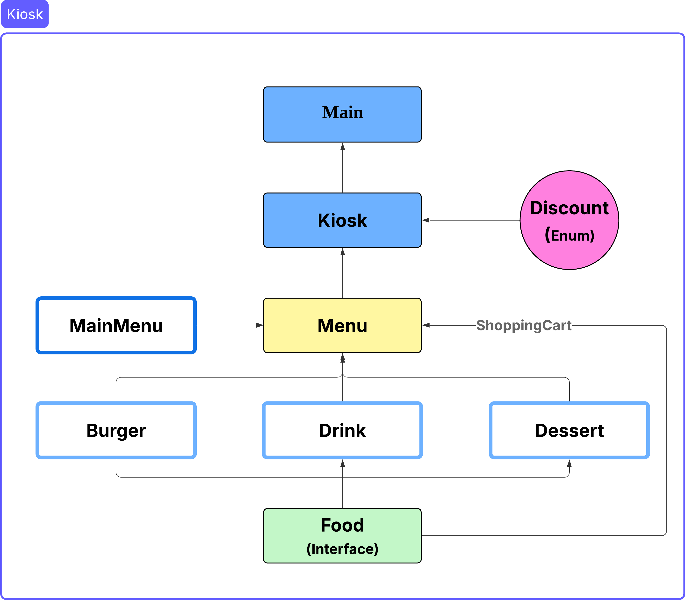

# 키오스크 만들기

**햄버거가게의 키오스크를 만들어라**

🐥 개발 기간 : 2025.04.24 ~ 2025.05.01

<br>
<br>

## ⚙️ 시작 가이드

### Config

아래 코드를 이용하여 레포지토리 클론 후 Config 적용

```
$ git clone https://github.com/GuDaeWoong/Kiosk.git
```

<br>
<br>

### 📁 Java Class Structure



<br>
<br>

### 요구사항 숙지

-   예를 들어, 기본적인 메뉴 선택 “입력”, “출력”, “각 메뉴 관리”, “전체 메뉴 관리” 등
-   사용자 인터페이스 방식 결정 : 콘솔 기반
-   예외 처리 : 입력값으로 허용한 값 이외의 값이 입력되었을 때와 같은 오류 처리

## Lv1 : 햄버거 메뉴 출력 및 선택

-   Scanner를 이용하여 미리 정의된 햄버거 메뉴 목록을 콘솔에 출력
-   사용자는 제시된 번호를 입력하여 특정 메뉴를 선택하거나, 특정 종료 번호를 입력하여 프로그램을 종료
-    입력 값에 따라 다른 로직이 실행되도록 구현

## Lv2 : 객체 지향 설계를 적용한 햄버거 메뉴 관리

-   MenuItem 클래스를 설계하여 각 햄버거 메뉴의 이름, 가격, 설명 속성을 관리
-   List를 사용하여 여러 MenuItem 객체를 저장하고 관리
-   반복문을 통해 menuItems 리스트의 각 항목에 접근하여 햄버거 메뉴 정보를 출력

## Lv3​ : 객체 지향 설계를 적용한 순서 제어 관리

-   Kiosk 클래스를 생성하여 프로그램의 전체적인 흐름 제어를 담당
-   Kiosk 클래스는 MenuItem 리스트를 필드로 가지며, start() 메서드를 통해 사용자 입력 처리 및 메뉴 선택 로직을 관리
-   main 함수에서는 Kiosk 객체를 생성하고 start() 메서드를 호출하여 프로그램을 실행
-   유효하지 않은 사용자 입력에 대한 오류 메시지 출력 및 특정 종료 값(0)을 통한 프로그램 종료 기능을 포함

## Lv4 ~ Lv5 : 객체 지향 설계를 적용한 음식 메뉴 및 주문 내역 관리 & 캡슐화

-   Menu 클래스를 생성하여 MenuItem 객체들을 관리
-   Menu 클래스는 메뉴 카테고리 이름 속성을 가지며, 해당 이름을 반환하는 메서드를 제공
-   클래스의 필드를 private으로 선언하고 접근자/설정자 메서드를 통해 캡슐화를 적용
-   클래스 간의 연계를 통해 객체 지향 프로그래밍의 기본적인 설계 개념을 이해하고, 사용자 입력에 따른 프로그램 흐름 제어 및 상태 관리

## Lv6 : 장바구니 및 구매 기능 추가

-   사용자가 선택한 메뉴를 담을 수 있는 장바구니 기능을 구현
-   장바구니에는 메뉴명, 수량, 가격 정보를 저장하며, 동적으로 항목 추가 및 조회 기능 구현
-   잘못된 사용자 선택에 대한 예외 처리를 구현
-   결제 전 장바구니에 담긴 모든 메뉴와 총 금액을 출력하는 기능을 제공
-   메뉴 선택 시 장바구니 추가 여부를 묻고, 사용자의 입력에 따라 추가 또는 취소 처리 구현
-   주문 완료 시 장바구니를 초기화하고 총 결제 금액을 계산하여 출력하는 기능을 구현

## LV7 : Enum, 람다 & Stream을 활용한 주문 및 장바구니 관리

-   Enum을 사용하여 사용자 유형별 할인율을 정의하고, 주문 시 해당 할인율을 적용하여 총 금액을 계산
-   람다 및 Stream API를 활용하여 Menu의 MenuItem을 조회하여 출력하는 기능을 구현
-   기존 장바구니에서 특정 메뉴를 되돌리는 기능을 Stream API를 활용하여 구현


<br>
<br>


최종 프로그램 실행시 콘솔

```
[ MAIN MENU ]
1. Burgers
2. Drinks
3. Desserts
0. 종료      | 종료
1 <- // 1을 입력

[ BURGERS MENU ]
1. ShackBurger   | W 6.9 | 토마토, 양상추, 쉑소스가 토핑된 치즈버거
2. SmokeShack    | W 8.9 | 베이컨, 체리 페퍼에 쉑소스가 토핑된 치즈버거
3. Cheeseburger  | W 6.9 | 포테이토 번과 비프패티, 치즈가 토핑된 치즈버거
4. Hamburger     | W 5.4 | 비프패티를 기반으로 야채가 들어간 기본버거
0. 뒤로가기
2 <- // 2를 입력
선택한 메뉴: SmokeShack | W 8.9 | 베이컨, 체리 페퍼에 쉑소스가 토핑된 치즈버거

// 2번을 누르면 나오는 메뉴입니다.
"SmokeShack | W 8.9 | 베이컨, 체리 페퍼에 쉑소스가 토핑된 치즈버거"
위 메뉴를 장바구니에 추가하시겠습니까?
1. 확인        2. 취소
1 <-

// 1번을 누르면 나오는 메뉴입니다.
SmokeShack 이 장바구니에 추가되었습니다.

// 장바구니에 물건이 들어 있으면 아래와 같이 [ ORDER MENU ] 가 추가로 출력됩니다.
// 만약에 장바구니에 물건이 들어 있지 않다면 [ ORDER MENU ] 가 출력되지 않습니다. 
// 미출력일 때 4,5 번을 누르면 예외를 던저줘야 합니다.
아래 메뉴판을 보시고 메뉴를 골라 입력해주세요.

[ MAIN MENU ]
1. Burgers
2. Drinks
3. Desserts
0. 종료      | 종료

[ ORDER MENU ]
4. Orders       | 장바구니를 확인 후 주문합니다.
5. Cancel       | 진행중인 주문을 취소합니다.
4 <- // 4를 입력

// 4번을 누르면 나오는 메뉴입니다.
아래와 같이 주문 하시겠습니까?

[ Orders ]
SmokeShack | W 8.9 | 베이컨, 체리 페퍼에 쉑소스가 토핑된 치즈버거

[ Total ]
W 8.9

1. 주문      2. 메뉴판
1 <-

// 1번을 누르면 할인 정보를 제공해줍니다.
할인 정보를 입력해주세요.
1. 국가유공자 : 10% 
2. 군인     :  5%
3. 학생     :  3%
4. 일반     :  0%
4 <-

// 4번을 누르면 나오는 메뉴입니다.
주문이 완료되었습니다. 금액은 W 8.9 입니다.
```


​<br>
<br>


## 기능 설명

### ⚙️ Main

-   Kiosk 객체를 성하여 키오스크 기능을 활성화
-   Kiosk 객체의 start() 메서드를 호출하여 키오스크 시스템을 실행

### 🖥️ Kiosk

-   start() 메서드를 통해 키오스크의 주요 기능을 순차적으로 실행
-   키오스크 이름에 따라 Menu에서 해당 메뉴 목록을 가져와 사용자에게 선택지를 제공
-   Lv6 요구사항에 따라 선택한 상품을 장바구니에 담는 기능을 제공
-   Lv7 요구사항에 따라 Discount Enum을 활용하여 할인 정책을 적용

### 📜 Menu

-   food 리스트와 mainItem 속성을 캡슐화하여 관리
-   새로운 음식 항목을 추가하고, 메인 메뉴 및 각 카테고리별 메뉴 목록을 출력하는 기능을 제공
-   키오스크에서 제공하는 전체 메뉴를 관리하는 역할
-  Lv6 요구사항에 따라 장바구니 (cart) 기능을 Menu 클래스 내에 구현하여 선택한 음식을 담을 수 있도록 구현

### 📌 MainMenu

-   메인 메뉴 항목의 속성을 정의

### 🍕 Food (Interface)

-   다양한 음식 항목(Burger, Drink, Dessert)이 구현해야 하는 기본적인 구조(예: 이름, 가격, 설명 등)를 정의하는 인터페이스
-   이를 통해 각 음식 항목들을 일관된 방식으로 관리할 수 있도록 구현

### 🍔 Burger, 🍰 Dessert, 🥤 Drink

-   각 음식 카테고리별 구체적인 속성을 정의하는 클래스
-   Food 인터페이스를 구현하여 다양한 음식 항목을 통일된 방식으로 관리할 수 있도록 설계

### 🏷️ Discount (Enum)

-   적용 가능한 할인 유형을 정의


<br>
<br>


## 🤔 키오스크 개발 회고

### Lv6 장바구니 기능 추가
```
private List<Food> cart = new ArrayList<>();
```
-   장바구니가 먼가? 떠올려보면 음식을 저장하는 역할을 하며, 쇼핑 카트와 같은 기능을 합니다

    이때 Food 인터페이스를 구현한 여러 메뉴 클래스들이 이미 존재한다는 것이 떠올랐습니다. 각 메뉴 항목은 이름 가겨 등 필요한 속성을 이미 가지고 있었고 장바구니에서 관리해야할 정보와도 일치했습니다. 따라서 새로운 장바구니 클래스를 만드는 대신 Food타입의 리스트를 재활용하여 기존 객체들을 담는 방식으로 구현했습니다.

    이러한 접근 방식은 음식 항목의 속성을 그대로 재활용할 수 있게 해주었고 필요에 따라 장바구니에 담긴 항목을 동적으로 추가하고나 제거하는 유연성을 가지고있었습니다.Lv6에서 요구하는 장바구니 기능에 가장 효율적으로 부합하는 방법이라고 판단하여 이를 구현하게 되었습니다.


### Lv7 Enum

-  이전에 계산기 프로젝트를 진행하면서 Enum을 사용해 보았지만, 당시에는 그 장점을 충분히 활용하지 못했다는 아쉬움이 있었습니다. 이번 키오스크 프로젝트에서는 Enum을 제대로 이해하고 활용해 보고자 노력했습니다.

    Enum은 관련된 상수 집합을 명확하게 정의하고, 코드의 타입 안전성을 높이는 데 효과적이라고 생각했습니다. 특히 람다 표현식과 함께 사용했을 때 코드의 간결성이 좋아짐이 보였습니다.

   잠시 메뉴 자체를 Enum으로 구현하는 것이 어떨까 하는 아이디어도 떠올랐습니다. Enum을 사용하면 메뉴 항목을 명확하게 정의하여 가독성을 높일 수 있을 것이라고 생각했습니다.
   하지만 각 메뉴마다 세부 속성이나 동작이 다를 수 있고 새로운 메뉴를 추가하거나 기존 메뉴를 삭제할 때마다 Enum을 수정해야하는 번거로움이 있을 것이라고 판단했습니다. 메서드 또한 확장이 매번 발생할 수 있다는 점도 생각이 들었습니다.

   결론적으로 메뉴 관리에 Enum을 직접적으로 사용하는 것보다는 할인정책과 같이 명확하게 정의된 상수 집합을 다루는데 Enum이 더 적합하다고 판단하고 이를 적용했습니다. 이번 경험을 통해 Enum의 장점과 한계를 이해했습니다.

​
